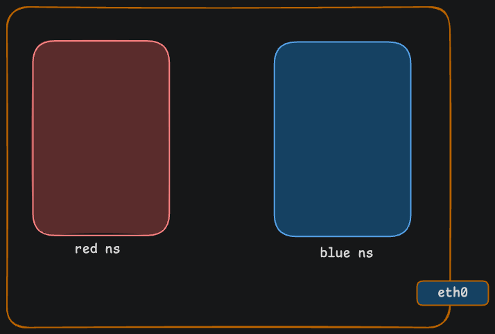

# Lab 01: Network Namespace Inspecting

## Objective

Create network namespaces, list them, run commands inside them, and inspect their network configuration.

## Prerequisites

- A Linux machine (Ubuntu, Debian, CentOS, etc.)
- Root access or sudo privileges

---

## What Is a Namespace Again?

A namespace is a closed-off network environment. Everything inside it — interfaces, IPs, routes, firewalls — is completely separate from the host and from other namespaces. It thinks it is the only thing on the network.

We use namespaces because without them, every container on your machine would see all the other network stuff. That is messy and insecure.

---

## Step 1: Create Two Namespaces

```bash
sudo ip netns add red
sudo ip netns add blue
```



**What this does:** Creates two empty network namespaces called `red` and `blue`. Each one only has a loopback interface right now.

**Why we need it:** We want two separate network worlds. Red should not know anything about Blue and vice versa.

**When to use:** Anytime you spin up a Docker container, Kubernetes pod, or isolated environment — they all create network namespaces.

---

## Step 2: List All Namespaces

```bash
sudo ip netns list
```

**What this does:** Shows you all the network namespaces that exist on your machine.

**Expected output:**

```
blue
red
```

**Why we need it:** To verify that your namespaces were actually created. Always check after creating something.

---

## Step 3: Run a Command Inside a Namespace

```bash
sudo ip netns exec red ip link show
```

**What this does:** Goes inside the `red` namespace and shows its network interfaces. You should see only `lo` (loopback). No `eth0`, no `veth`, nothing from the host.

**Why we need it:** To prove that the namespace is isolated. It can only see its own stuff.

**Expected output:**

```
1: lo: <LOOPBACK> mtu 65536 qdisc noop state DOWN mode DEFAULT group default qlen 1000
    link/loopback 00:00:00:00:00:00 brd 00:00:00:00:00:00
```

---

## Step 4: Check What the Host Sees

```bash
ip netns exec red ip addr
```

**What this does:** Shows the full network details inside the red namespace — interfaces, IP addresses, everything.

**Why we need it:** To see the complete picture. Right now red has no IP and no extra interfaces. It is a blank slate.

**Expected output:**

```
1: lo: <LOOPBACK> mtu 65536 qdisc noop state DOWN group default qlen 1000
    link/loopback 00:00:00:00:00:00 brd 00:00:00:00:00:00
```

---

## Step 5: Try to Ping Loopback Inside the Namespace

```bash
sudo ip netns exec red ping -c 2 127.0.0.1
```

**What this does:** Pings the loopback address inside the red namespace.

**Why we need it:** To confirm that the loopback interface works even inside a namespace. Every namespace has its own loopback.

**Expected output:**

```
PING 127.0.0.1 (127.0.0.1) 56(84) bytes of data.
64 bytes from 127.0.0.1: icmp_seq=1 ttl=64 time=0.012 ms
64 bytes from 127.0.0.1: icmp_seq=2 ttl=64 time=0.034 ms

--- 127.0.0.1 ping statistics ---
2 packets transmitted, 2 received, 0% packet loss, time 1002ms
rtt min/avg/max/mdev = 0.012/0.023/0.034/0.011 ms
```

---

## Step 6: Execute a Shell Inside the Namespace

```bash
sudo ip netns exec red bash
```

**What this does:** Drops you into a bash shell that is running inside the red namespace. Everything you do from here stays inside that namespace.

**Why we need it:** Sometimes you want to run multiple commands without typing `ip netns exec red` every time. This puts you inside the namespace so you can just run commands directly.

Type `exit` to leave the namespace shell.
  
---
# Test Connectivity
  
Ping between the two namespaces to verify everything works, and inspect the ARP cache.
  
## Step 8: Ping from Red to Blue

```bash
sudo ip netns exec red ping -c 5 192.168.0.2
```

**What this does:** Goes into the red namespace and sends 5 ping packets to blue's IP (`192.168.0.2`).

**Why we need it:** This is the moment of truth. If the ping works, your entire setup is correct — namespaces are isolated, veth is connected, IPs are assigned, interfaces are up, and routing works.

**Expected output:**

```
PING 192.168.0.2 (192.168.0.2) 56(84) bytes of data.
64 bytes from 192.168.0.2: icmp_seq=1 ttl=64 time=0.024 ms
64 bytes from 192.168.0.2: icmp_seq=2 ttl=64 time=0.069 ms
64 bytes from 192.168.0.2: icmp_seq=3 ttl=64 time=0.063 ms
64 bytes from 192.168.0.2: icmp_seq=4 ttl=64 time=0.064 ms
64 bytes from 192.168.0.2: icmp_seq=5 ttl=64 time=0.063 ms
^C
--- 192.168.0.2 ping statistics ---
5 packets transmitted, 5 received, 0% packet loss, time 4099ms
rtt min/avg/max/mdev = 0.024/0.056/0.069/0.016 ms
```

**What to look for:** `0% packet loss` means all 5 packets made it across. If you see `100% packet loss`, something went wrong in an earlier step.

---

## Step 9: Ping from Blue to Red

```bash
sudo ip netns exec blue ping -c 5 192.168.0.1
```

**What this does:** Goes into the blue namespace and pings red's IP (`192.168.0.1`).

**Why we need it:** To confirm both directions work. Sometimes one way works but the other does not due to routing issues.

**Expected output:**

```
PING 192.168.0.1 (192.168.0.1) 56(84) bytes of data.
64 bytes from 192.168.0.1: icmp_seq=1 ttl=64 time=0.033 ms
64 bytes from 192.168.0.1: icmp_seq=2 ttl=64 time=0.072 ms
64 bytes from 192.168.0.1: icmp_seq=3 ttl=64 time=0.071 ms
64 bytes from 192.168.0.1: icmp_seq=4 ttl=64 time=0.074 ms
64 bytes from 192.168.0.1: icmp_seq=5 ttl=64 time=0.070 ms
^C
--- 192.168.0.1 ping statistics ---
5 packets transmitted, 5 received, 0% packet loss, time 4099ms
rtt min/avg/max/mdev = 0.033/0.064/0.074/0.015 ms
```

---

## Step 9: Check the ARP Cache

ARP stands for Address Resolution Protocol. It is how your machine maps an IP address to a physical MAC address. The first time you ping someone, your machine asks who has this IP and the other side responds with its MAC. That mapping gets stored in the ARP cache.

Check red's ARP table:

```bash
sudo ip netns exec red arp
```

**Expected output:**

```
Address                  HWtype  HWaddress           Flags Mask            Iface
192.168.0.2              ether   2e:34:8e:0c:1c:6e   C                     veth-red
```

Check blue's ARP table:

```bash
sudo ip netns exec blue arp
```

**Expected output:**

```
Address                  HWtype  HWaddress           Flags Mask            Iface
192.168.0.1              ether   22:21:fc:9e:d0:2b   C                     veth-blue
```

**How to read this:**

- **Address** — The IP that was learned
- **HWaddress** — The MAC address of that IP
- **Flags** — `C` means complete and confirmed
- **Iface** — Which interface it was learned on

**Why this matters:** If you are debugging and the ping is not working, check the ARP table. If it says `incomplete`, that means the machine tried to find the other side but never got a response. That tells you the problem is at the link layer, not the routing layer.
 
---

## Summary

| What | Command |
|------|---------|
| Create namespace | `sudo ip netns add <name>` |
| List namespaces | `sudo ip netns list` |
| Run command in namespace | `sudo ip netns exec <name> <command>` |
| Open shell in namespace | `sudo ip netns exec <name> bash` |
| Delete namespace | `sudo ip netns del <name>` |
| Ping from namespace | `sudo ip netns exec <ns> ping -c 5 <ip>` |
| Check ARP cache | `sudo ip netns exec <ns> arp` |


---


## Step 10: Clean Up

```bash
sudo ip netns del red
sudo ip netns del blue
```

**What this does:** Deletes both namespaces. All interfaces, IPs, and routes inside them get removed automatically.

**Why we need it:** To clean up after yourself. You do not want old namespaces sitting around causing confusion.


**Next Lab:** [02 - Connect Network NS with Host](../02-connect-network-ns-to-HOST/)
