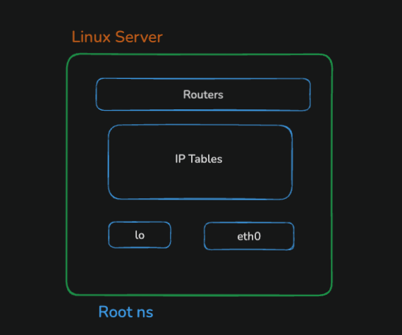
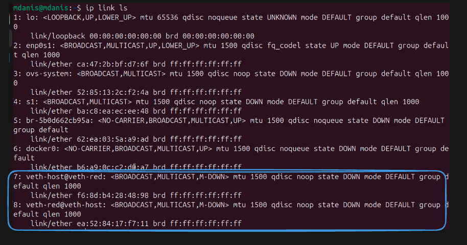
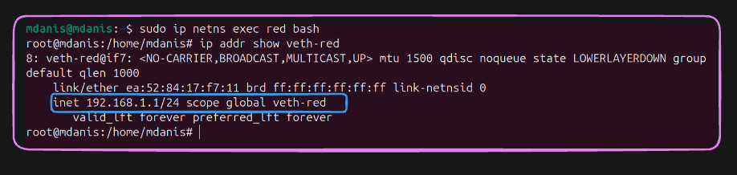
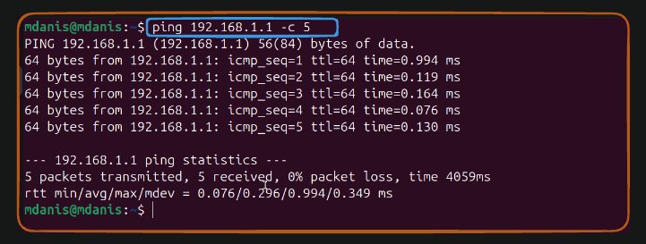
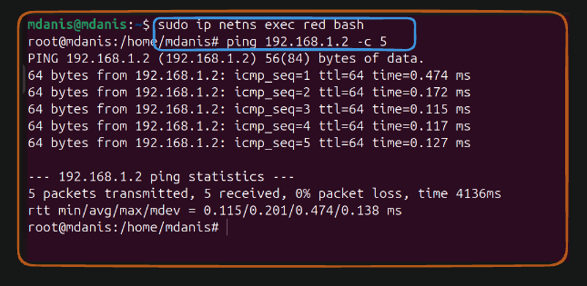
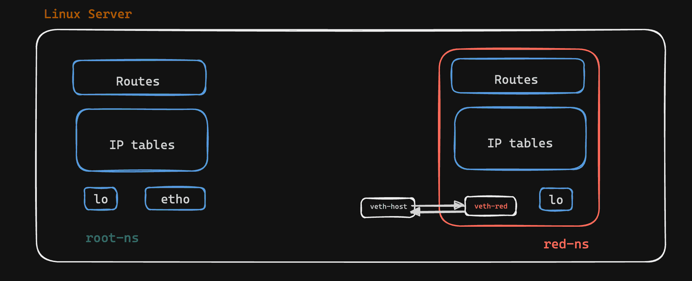

# Lab 02: Connect Network Namespace to Host

## What We Are Building

In this lab, we create a network namespace called `red` and connect it to your computer (the host) using a virtual ethernet cable.

Here is what the final setup looks like:



## Objective

Create a network namespace and connect it to your computer so that the namespace can talk to the host and the host can talk back.

## Prerequisites

- A Linux machine (Ubuntu, Debian, CentOS, etc.)
- Root access or sudo privileges

---

## What Is a veth Pair?

A veth pair is like a virtual ethernet cable. It has two ends. Whatever you send into one end comes out the other end. We use it to connect two network namespaces together, or to connect a namespace to the host.

One end will be called `veth-red` (we will put this inside the red namespace).
The other end will be called `veth-host` (this stays on the host).

---

## Step 1: Create the Red Namespace

```bash
sudo ip netns add red
```

**What this does:** Creates a new empty network namespace named `red`. Right now it only has a loopback interface and nothing else.

**Why we need it:** We need a separate network environment to play with. `red` is our isolated world.

**When to use:** Every time you start a Docker container, Linux creates a namespace like this behind the scenes.

---

## Step 2: List All Namespaces

```bash
sudo ip netns list
```

**What this does:** Shows every network namespace that exists on your machine right now.

**Expected output:**

```
red
```

**Why we need it:** To make sure `red` was actually created. It is a good habit to check after every creation command.

---

## Step 3: Create the veth Pair

```bash
sudo ip link add veth-red type veth peer name veth-host
```

**What this does:** Creates two virtual ethernet interfaces and links them together. Think of it like plugging one end of a cable into `veth-red` and the other end into `veth-host`.

**Why we need it:** Without a cable, `red` cannot talk to the host. The veth pair is that cable.

**How to verify:** Run `ip link` or `ip link show` to see the new interfaces listed.



---

## Step 4: Move One End Into the Red Namespace

```bash
sudo ip link set veth-red netns red
```

**What this does:** Takes the `veth-red` interface and moves it inside the `red` namespace.

**Why we need it:** Right now both ends of the cable are on the host. We need one end inside `red` so that the namespace has its own network interface.

---

## Step 5: Give the Red Side an IP Address

```bash
sudo ip netns exec red ip addr add 192.168.1.1/24 dev veth-red
```

**What this does:** Goes inside the `red` namespace and assigns the IP address `192.168.1.1` to the `veth-red` interface. The `/24` means it is on the network `192.168.1.0`.

**Why we need it:** Every device on a network needs an IP address to talk to others. This is `red`'s address.

**When to use:** Any time you create a new interface, you must give it an IP before it can communicate.



---

## Step 6: Turn On the Red Side

```bash
sudo ip netns exec red ip link set veth-red up
```

**What this does:** Turns the `veth-red` interface on (activates it).

**Why we need it:** By default, new interfaces are turned off. An interface that is down cannot send or receive any traffic.

---

## Step 7: Give the Host Side an IP Address

```bash
sudo ip addr add 192.168.1.2/24 dev veth-host
```

**What this does:** Assigns the IP address `192.168.1.2` to the `veth-host` interface on your computer.

**Why we need it:** The host needs its own address on this virtual cable. `192.168.1.2` is the host's side, while `192.168.1.1` is `red`'s side.

**Note:** Notice we do not use `ip netns exec` here. That is because we are running this command on the host, not inside a namespace.

---

## Step 8: Turn On the Host Side

```bash
sudo ip link set veth-host up
```

**What this does:** Turns the `veth-host` interface on.

**Why we need it:** Same reason as before. The interface must be up to work.

---

## Step 9: Add a Route

```bash
sudo ip route add 192.168.1.1 dev veth-host
```

**What this does:** Tells the host exactly how to reach `red`'s IP address (`192.168.1.1`). It says: "to reach 192.168.1.1, send it out through `veth-host`".

**Why we need it:** In many cases Linux adds this route automatically when you bring the interface up. But adding it manually helps you see what is happening. It is good for learning.

**What is a route?** A route is like a map in your computer. It tells the kernel where to send a packet based on its destination address.

---

## Step 10: Test Connectivity from Host to Red

```bash
ping 192.168.1.1 -c 3
```

**What this does:** Sends 3 ping packets from your computer to `red`'s IP address.

**Why we need it:** To confirm that the cable is working and `red` can be reached from the host.

**Expected output:**

```
PING 192.168.1.1 (192.168.1.1) 56(84) bytes of data.
64 bytes from 192.168.1.1: icmp_seq=1 ttl=64 time=0.012 ms
64 bytes from 192.168.1.1: icmp_seq=2 ttl=64 time=0.034 ms
64 bytes from 192.168.1.1: icmp_seq=3 ttl=64 time=0.034 ms

--- 192.168.1.1 ping statistics ---
3 packets transmitted, 3 received, 0% packet loss, time 2003ms
rtt min/avg/max/mdev = 0.012/0.027/0.034/0.011 ms
```

**What to look for:** `0% packet loss`. That means all 3 packets made it through. If you see `100% packet loss`, something is wrong. Go back and check if both interfaces are up.



---

## Step 11: Test Connectivity from Red to Host

First, enter the red namespace:

```bash
sudo ip netns exec red bash
```

Now you are inside `red`. Run this:

```bash
ping 192.168.1.2 -c 3
```

**What this does:** Sends 3 ping packets from `red` to the host's IP address (`192.168.1.2`).

**Why we need it:** To confirm that `red` can reach the host. Connection should work both ways.

**Expected output:**

```
PING 192.168.1.2 (192.168.1.2) 56(84) bytes of data.
64 bytes from 192.168.1.2: icmp_seq=1 ttl=64 time=0.012 ms
64 bytes from 192.168.1.2: icmp_seq=2 ttl=64 time=0.034 ms
64 bytes from 192.168.1.2: icmp_seq=3 ttl=64 time=0.034 ms

--- 192.168.1.2 ping statistics ---
3 packets transmitted, 3 received, 0% packet loss, time 2003ms
rtt min/avg/max/mdev = 0.012/0.027/0.034/0.011 ms
```

**How to leave the namespace:** Type `exit` and press Enter.



---

## The Virtual Ethernet Pair Is Now Ready

At this point, `red` and your host are connected just like two computers connected by a real ethernet cable.




# Key Things to Remember

| Concept | Simple meaning |
|---|---|
| Network Namespace | A separate network world |
| Root NS | The main network namespace of Linux |
| veth pair | A virtual Ethernet cable |
| `veth-host` | Host-side end of the cable |
| `veth-red` | Namespace-side end of the cable |
| IP address | Gives an interface an identity on a network |
| `/24` | Defines the network range |
| Routing table | Tells Linux where packets should go |
| `ping` | Simple way to test network connectivity |

## The most important idea

**A veth pair connects two network namespaces.**

```text
Namespace A
     |
   veth-A
     |
   veth-B
     |
Namespace B
```


## Summary

| What | Command |
|------|---------|
| Create namespace | `sudo ip netns add red` |
| List namespaces | `sudo ip netns list` |
| Create veth pair | `sudo ip link add veth-red type veth peer name veth-host` |
| Move interface to namespace | `sudo ip link set veth-red netns red` |
| Add IP inside namespace | `sudo ip netns exec red ip addr add 192.168.1.1/24 dev veth-red` |
| Bring interface up (inside ns) | `sudo ip netns exec red ip link set veth-red up` |
| Add IP on host | `sudo ip addr add 192.168.1.2/24 dev veth-host` |
| Bring interface up (host) | `sudo ip link set veth-host up` |
| Add route | `sudo ip route add 192.168.1.1 dev veth-host` |
| Ping from host | `ping 192.168.1.1 -c 3` |
| Ping from namespace | `sudo ip netns exec red ping 192.168.1.2 -c 3` |
| Open shell in namespace | `sudo ip netns exec red bash` |
| Delete namespace | `sudo ip netns del red` |

---

## Step 12: Clean Up

```bash
sudo ip netns del red
```

**What this does:** Deletes the `red` namespace and everything inside it. The `veth-host` interface on the host will also disappear because it was paired with `veth-red`.

**Why we need it:** To clean up your machine. You do not want old namespaces and virtual interfaces hanging around after the lab.

**Next Lab:** [03 - Connect Network NS to ROOT](../03-connect-network-ns-to-ROOT/)
