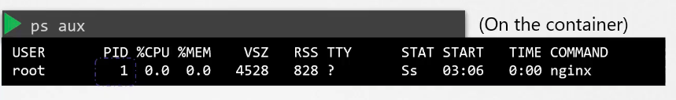
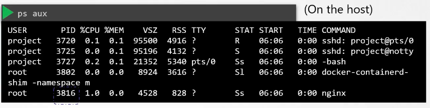
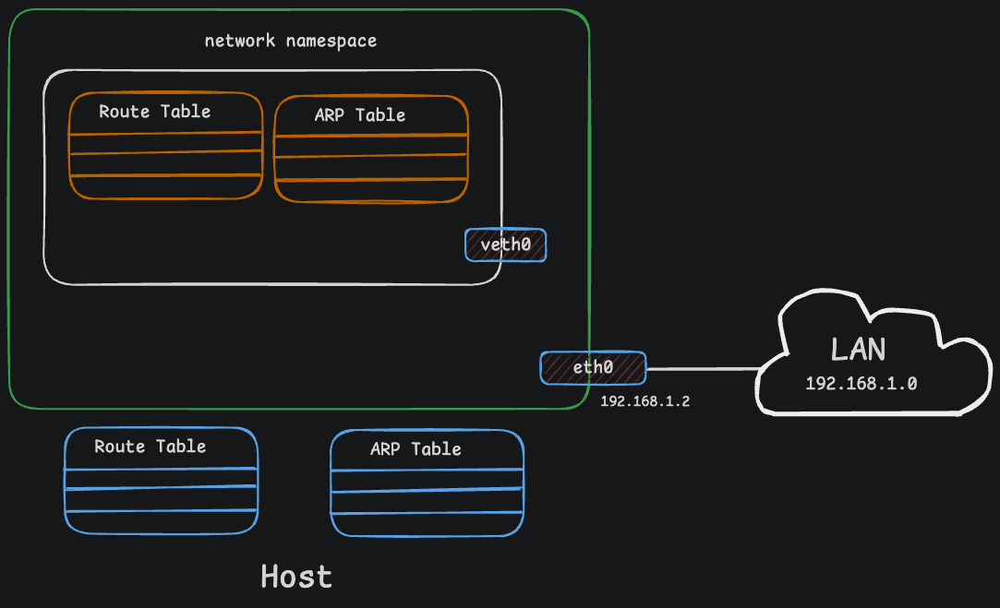

# Linux Network Namespaces

A hands-on lab series for understanding **Linux network namespaces and container networking**, starting from basic namespace inspection and gradually progressing to veth pairs, IP addressing, routing, Linux bridges, egress traffic, and the Forwarding Information Base (FIB).


---

## What Are Network Namespaces?

A **Linux network namespace** provides an isolated network stack within the Linux kernel.

Each network namespace can have its own:

* Network interfaces
* IP addresses
* Routing tables
* ARP/neighbor tables
* Firewall rules
* Network sockets and ports

By default, network namespaces are isolated from one another. To allow them to communicate, we must explicitly create a networking path using mechanisms such as **veth pairs, Linux bridges, and routing**.

This is one of the fundamental building blocks behind modern **container networking**. Technologies such as Docker and Kubernetes use Linux namespaces and other kernel networking features to provide isolated networking environments for containers.

---

# 📖 The Story: The Linux Kingdom

Once upon a time, there was a large and modern palace called the **Linux Kingdom**.

The ruler of this kingdom was the **Host System**.

The Emperor had four children who lived inside the same palace. Sharing the same space created chaos. If one child changed something, another could accidentally be affected.

The Emperor wanted to give each child their own private space while still maintaining control over the entire palace.

So, he introduced **Network Namespaces**.

---

## 🏠 The Rooms — Network Namespaces

The Emperor built four separate rooms inside the palace.

Each room had its own independent networking environment. From inside one room, a child could not automatically see the networking resources of another room.

Each room had its own:

| Palace Concept        | Linux Networking Concept | Purpose                                 |
| --------------------- | ------------------------ | --------------------------------------- |
| 🏠 Private room       | **Network Namespace**    | Provides an isolated network stack      |
| 🏷️ Room address      | **IP Address**           | Identifies a network interface          |
| 🗺️ Road map          | **Routing Table**        | Determines where packets should be sent |
| 🚪 Service doors      | **Port Numbers**         | Identify network services               |
| 📞 Communication line | **veth Pair**            | Connects two network namespaces         |
| 🏢 Common lounge      | **Linux Bridge**         | Connects multiple network interfaces    |
| 🚧 Palace gate        | **NAT**                  | Translates addresses between networks   |

Each child could now manage their own networking environment without directly interfering with the others.

---

## 🔑 The Master Key — Root Privileges

Although the children were isolated, the Emperor still controlled the entire palace.

In Linux, a privileged user can inspect and manage network namespaces using commands such as:

```bash
sudo ip netns list
sudo ip netns exec <namespace> <command>
```

The important distinction is:

> **Root user** and **root network namespace** are not the same thing.

The root user is a privileged Linux user, while the root network namespace is the default network namespace associated with the host.

---

## 📞 The Intercom Thread — veth Pair

The children eventually wanted to communicate with one another.

The Emperor created a special virtual Ethernet cable with two ends.

This is called a **veth pair**.

A veth pair always consists of two connected virtual Ethernet interfaces. Packets transmitted through one end appear at the other end.

For example:

```text
        Network Namespace A
        ┌───────────────────┐
        │     veth-a        │
        └─────────┬─────────┘
                  │
             Virtual Cable
                  │
        ┌─────────┴─────────┐
        │     veth-b        │
        └───────────────────┘
        Network Namespace B
```

Each end can be placed in a different network namespace, allowing isolated namespaces to communicate.

---

## 🏢 The Common Lounge — Linux Bridge

Eventually, all the children wanted to communicate through a shared network.

The Emperor built a **Linux bridge** — a virtual Layer 2 switch.

Multiple namespace interfaces could connect to the bridge:

```text
                  Linux Bridge
                ┌──────────────┐
                │              │
          ┌─────┴─────┐  ┌─────┴─────┐
          │           │  │           │
        veth-a      veth-b        veth-c
          │           │             │
        ns-a        ns-b          ns-c
```

The bridge forwards Ethernet frames between connected interfaces based on MAC addresses.

This is conceptually similar to a physical Ethernet switch.

---

## 🚧 The Gate Guard — NAT

The children eventually wanted access to networks outside the palace.

The Emperor created a gateway at the palace entrance.

**NAT (Network Address Translation)** can translate private/internal source addresses into an address usable on an external network.

A simplified topology might look like:

```text
Network Namespace
       │
       │
   Linux Bridge
       │
       │
     Host
       │
      NAT
       │
       ▼
   External Network
```

This is a common pattern in container networking.

---

# 🔑 Key Takeaways

| Story Element          | Linux Concept              | Description                                                     |
| ---------------------- | -------------------------- | --------------------------------------------------------------- |
| 🏠 The Rooms           | **Network Namespaces**     | Provide isolated Linux network stacks.                          |
| 👑 The Emperor         | **Host / Root Privileges** | Provides administrative control over namespaces and networking. |
| 📞 The Intercom Thread | **veth Pair**              | Provides a virtual point-to-point Ethernet connection.          |
| 🏢 The Common Lounge   | **Linux Bridge**           | Connects multiple interfaces at Layer 2.                        |
| 🚧 The Gate Guard      | **NAT**                    | Translates addresses between internal and external networks.    |
| 🗺️ The Road Map       | **Routing Table**          | Determines the next hop for packets.                            |

---

# 🐳 How Containers Use Network Namespaces

Linux network namespaces are an important building block of container networking.

When a container is created, the container runtime can place its network interfaces and network stack inside an isolated network namespace.

From inside the container, the networking environment can look like an independent machine:



However, the host can manage and inspect the container's networking environment from outside the namespace:



The host and container can therefore have separate:

* Network interfaces
* IP addresses
* Routing tables
* ARP/neighbor tables
* Network configuration



Understanding network namespaces makes it much easier to understand what happens underneath technologies such as **Docker, Kubernetes, Containerd, and CNI-based networking**.

---

# 🌐 Why Learn Network Namespaces?

Container networking can feel like a black box when you only interact with high-level tools.

This lab series takes the opposite approach.

Instead of starting with Docker or Kubernetes, we build the networking environment manually using Linux kernel networking primitives:

```text
Network Namespace
        ↓
     veth Pair
        ↓
   IP Addressing
        ↓
    Interfaces
        ↓
     Routing
        ↓
   Connectivity
        ↓
  Linux Bridge
        ↓
   FIB & Routing
        ↓
 Container Networking
```

By completing the labs, you will understand the fundamental concepts that modern container networking is built upon.

---

# 🛠️ Tools & Technologies

The labs primarily use standard Linux networking tools and concepts:

* Linux Network Namespaces
* `iproute2`
* veth pairs
* Linux Bridge
* IP addressing
* ARP / Neighbor Discovery
* Routing tables
* Forwarding Information Base (FIB)
* NAT
* `ping`
* Network interface management
* Linux packet forwarding

---

# 📋 Prerequisites

Before starting the labs, you should have a basic understanding of:

* Linux command-line usage
* IPv4 addressing
* Subnets
* Ethernet and MAC addresses
* ARP
* Basic routing concepts
* Linux processes and permissions

You should also have:

* A Linux environment
* `iproute2` installed
* `sudo` or root privileges

> **Recommended:** Run these labs inside a disposable Linux VM or dedicated test environment. Some labs modify network configuration and may affect connectivity on the system.

---

# 🧪 Lab Series

|      # | Lab                                                                        | What You Will Learn                                                                                                         |
| -----: | -------------------------------------------------------------------------- | --------------------------------------------------------------------------------------------------------------------------- |
| **01** | [Network Namespace Inspecting](./01-network-namespace-inspecting/)         | Create, list, enter, and inspect isolated Linux network namespaces and their network interfaces.                            |
| **02** | [Connect Network NS with Host](./02-connect-network-ns-to-HOST/)           | Create a veth pair and establish a virtual network connection between a network namespace and the host network namespace.   |
| **03** | [Connect Network NS with Root](./03-connnect-network-ns-to-ROOT/)          | Configure IP addresses and establish Layer 3 connectivity between a network namespace and the root network namespace.       |
| **04** | [Egress Traffic](./04-Egress-Traffic/)                                     | Enable interfaces and configure a namespace to send outbound traffic through the host.                                      |
| **05** | [Connect Two Namespaces](./05-connect-two-ns/)                             | Connect two isolated network namespaces using veth pairs and configure routing for namespace-to-namespace communication.    |
| **06** | [Bridge Networking Among NS](./06-Bridge-networking-among-ns/)             | Connect multiple network namespaces using a Linux bridge and inspect Layer 2 connectivity and ARP.                          |
| **07** | [Process Communication Between NS](./07-process-communication-between-ns/) | Explore how processes communicate through network interfaces across isolated network namespaces.                            |
| **08** | [FIB Network Topology](./08-fib-network-topology/)                         | Explore the Linux Forwarding Information Base (FIB), routing tables, and how the kernel determines packet forwarding paths. |

---

# 🗺️ Learning Path

The labs are designed to build knowledge progressively:

**Namespaces → veth → IP Addressing → Interfaces → Routing → Connectivity → Bridge → FIB**

Each lab introduces a new networking concept while building upon the configuration created in previous labs.

By the end of the series, you should be able to manually construct and troubleshoot basic Linux network topologies and have a much stronger foundation for understanding container networking.

---

## 👨‍💻 Author

**MD Anis**

**Last Updated:** August 2026
